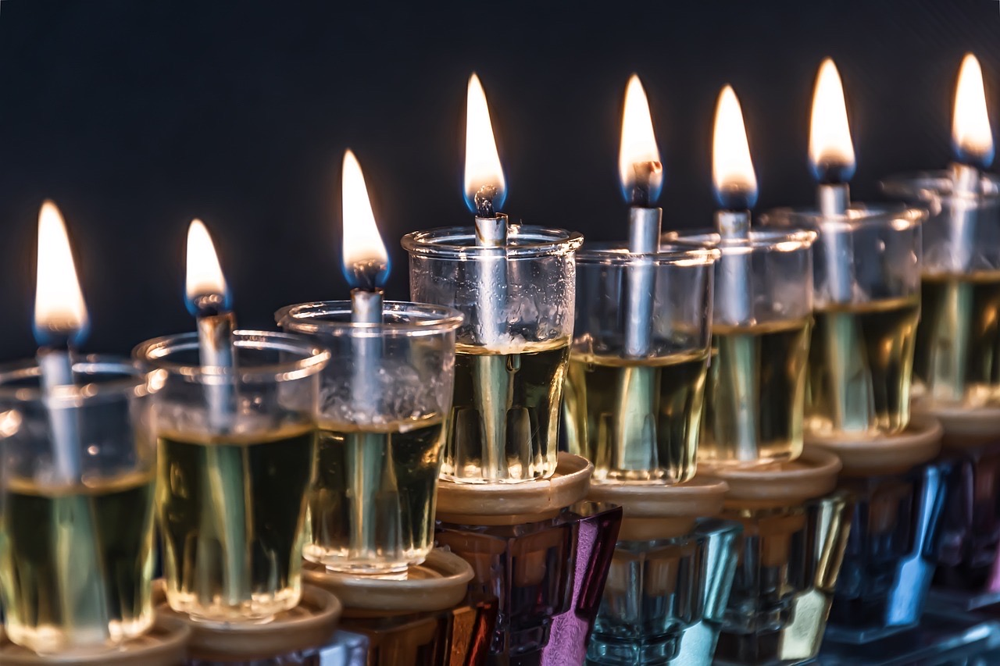

# Hanukkah

חֲנֻכָּה‎ or חֲנוּכָּה‎

> Numbers 7:10
> Now the leaders offered the dedication offering for the altar when it was anointed; so the leaders offered their offering before the altar.

Ḥănukkā
Meaning: Dedication or rededication

 

Uses a special menora: instead of the seven candle lamp stand this one uses 9. The central most light is called the Shamash or the attendent. 

שַׁמָּשׁ

It gives light to the others.

The holiday commemorates the recapture of jerusalem in 164 BC.

There is a legend that there was a miraculous consumption of oil (the claim is there was only one day of oil, but the oil burned for the full eight to dedicate a new alter). This miracle is has no additional sources, maybe it happened, maybe it didn't. The real miracle is a rag tag gollia army of hebrews retook the temple from the greeks in the first place.

The burning of the lamps for eight days is a commemoration of the eight days of dedication to set up a new alter.

----

In Jesus' day, Hanukka was an unofficial fourth holiday of mandatory gathering. The Law did not mention this day at all. But I still think it is significant. 

If one could find long term lodging through winter in or near Jerusalem—they would. This is why Jesus would be walking in solomon's porch in John 10:23

> John 10:23
> And Jesus walked in the temple, in Solomon's porch.

----

> John 10:22-30
> Now it was the Feast of Dedication in Jerusalem, and it was winter. And Jesus walked in the temple, in Solomon's porch. Then the Jews surrounded Him and said to Him, "How long do You keep us in doubt? If You are the Christ, tell us plainly."
> 
> Jesus answered them, "I told you, and you do not believe. The works that I do in My Father's name, they bear witness of Me. But you do not believe, because you are not of My sheep, as I said to you. My sheep hear My voice, and I know them, and they follow Me. And I give them eternal life, and they shall never perish; neither shall anyone snatch them out of My hand. My Father, who has given them to Me, is greater than all; and no one is able to snatch them out of My Father's hand.
> 
> I and My Father are one."

Then it is said
> John 10:31
> Then the Jews took up stones again to stone Him.

## What were these stones?

It is written in the history (not biblical history) that when the temple was recaptured in 164 BC there was a problem:

The alter had been dedicated to God thus it would be a sin to throw it away. The alter had also been used to sacrifice an unclean animal (a pig to honor the greek king Antichous). It was no longer clean to offer to God. They couldn't use it. They couldn't throw it away.

Tradition says the Hasmonians disassembled the defiled alter and stacked the stones in solomon's porch. Tradition also says the Hasmonians said, "when Missah comes, He will tell us what to do with these stones."

Solomon's Porch would have been kept very clean. There was nothing there that shouldn't be there.

If the tradition is true the only stones that would be in Solomon's Porch would be the stones that the Hasmonians taught Messiah would tell them what to do with.

On Hannuka in Jesus' day they tried to stone Him.

----

I think Hanukka is a Christian holiday:
- The attendent that lights the other candles is like Christ who gives us light.

It is in the middle: 
> Revelation 1:13
> and in the midst of the seven lampstands One like the Son of Man, clothed with a garment down to the feet and girded about the chest with a golden band.
